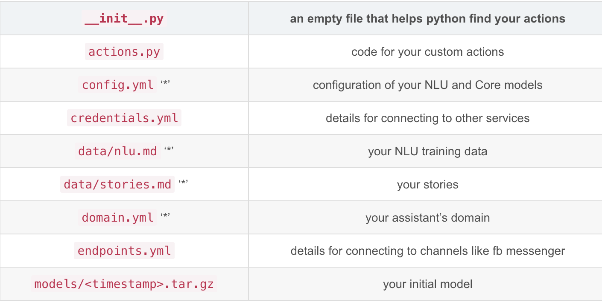
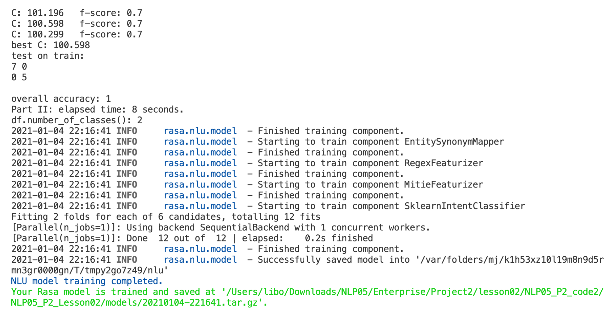
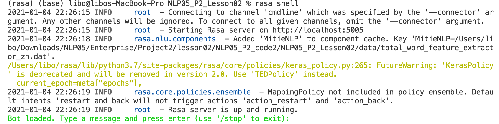
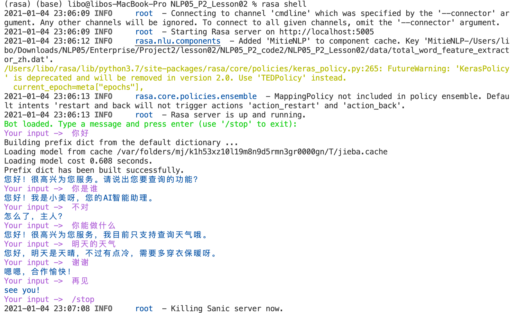

## 作业内容
- 使用RASA在任意一个对话场景实现一个中文对话机器人


## 作业代码简介
- Rasa是一个开源机器学习框架，主要有两个主要模块：NLU模块和Core模块，其中NLU模块负责实现意图识别和槽值提取，将用户的输入转换为结构化数据，Core模块是一个对话管理平台，用于预测决定下一步作什么。
- 通过以下代码建立名为rasa的python虚拟环境，然后激活这个虚拟环境
    ```shell
    python3 -m venv rasa
    source ~/rasa/bin/activate
    ```
- 为了稳定起见，在该rasa环境安装版本为1.10.12的rasa安装包
  ```shell
  pip install rasa==1.10.12
  ```
- 运行rasa init自动生成rasa项目所需的所有文件，如下图所示，主要的文件夹有data,models,tests，主要的配置文件config.yml和domain.yml.

- 需要进行编辑自定义的文件为data文件夹中的nlu.md和stories.md，以及根目录中的额config.yml和domain.yml文件。这里我们构造关于查询天气的训练样本数据。
- 构建NLU模型训练样本数据nlu.md如下：
  ```markdown
  ## intent:greet
    - 你好
    - 你好啊
    - 早上好
    - 晚上好
    - hello
    - hi
    - 嗨
    - 嗨喽
    - 见到你很高兴
    - 嘿
    - 早
    - 上午好
    - hello哈喽
    - 哈喽哈喽
    - hello hello
    - 喂喂

    ## intent:goodbye
    - goodbye
    - bye
    - bye bye
    - 88
    - 886
    - 再见
    - 拜
    - 拜拜
    - 拜拜，下次再聊
    - 下次见
    - 回头见
    - 下次再见
    - 下次再聊
    - 有空再聊
    - 先这样吧
    - 好了，就说这么多了
    - 好了，先这样
    - 没事

    ## intent:whoareyou
    - 你是谁
    - 我知道你吗
    - 谁
    - 我认识你吗
    - 这是谁啊
    - 是谁
    - 请问你是谁
    - 请问我认识你吗
    - 你是哪位
    - 你是？
    - 是谁？
    - 可以告诉我你的名字吗
    - 你叫什么名字

    ## intent:whattodo
    - 你支持什么功能
    - 你有什么功能
    - 你能干什么
    - 你能做什么

    ## intent:thanks
    - 谢谢
    - thanks
    - thank you
    - 真的太感谢你了，帮了我大忙
    - 谢谢你帮了我大忙
    - 你帮了我大忙，谢谢你小智
    - 非常感谢
    - 谢了

    ## intent:deny
    - 不
    - no
    - 不可以
    - 不是的
    - 不认同
    - 否定
    - 不是这样子的
    - 我不同意你的观点
    - 不同意
    - 不好
    - 你长得很美，就不要想得太美。
    - 拒绝
    - 不行

    ## intent:affirm
    - 是的
    - 当然
    - 好的
    - ok
    - 嗯
    - 可以
    - 你可以这么做
    - 你做得可以啊
    - 同意
    - 听起来不错
    - 是这样的
    - 的确是这样子的
    - 我同意你的观点
    - 对的
    - 好滴
    - 行
    - 还行
    - 当然可以

    ## intent: request_weather
    - 天气
    - 查询天气
    - 帮我查天气信息
    - 我想知道[明天](date-time)的天气
    - [星期一](date-time)的天气
    - [今天](date-time)的天气怎么样
    - 帮我查下[后天](date-time)的天气
    - 查下[广州](address)的天气怎么样
    -  [长沙](address)的天气
    - [深圳](address)[明天](date-time)的天气
    - 查下[今天](date-time)[上海](address)的天气
    - 帮我查查[佛山](address)这[周六](date-time)的天气
  ```
- 构建对话模型Core训练样本如下，存入data中的stories.md文件
  ``` markdown
    ## greet
    * greet
        - utter_answer_greet

    ## say affirm  with greet
    * greet
        - utter_answer_greet
    * affirm
        - utter_answer_affirm
        
    ## say affirm 
    * affirm
        - utter_answer_affirm
        
    ## say no with greet
    * greet
        - utter_answer_greet
    * deny
        - utter_answer_deny
        
    ## say no 
    * deny
        - utter_answer_deny


    ## say goodbye
    * goodbye
        - utter_answer_goodbye
        
    ## thanks with greet
    * greet
        - utter_answer_greet
    * thanks
        - utter_answer_thanks
        
    ## thanks
    * thanks
        - utter_answer_thanks
        
    ## who are you with greet
    * greet
        - utter_answer_greet
    * whoareyou
        - utter_answer_whoareyou
        
    ## who are you
    * whoareyou
        - utter_answer_whoareyou
        
    ## who are you with greet
    * greet
        - utter_answer_greet
    * whoareyou
        - utter_answer_whoareyou
        
    ## what to do
    * whattodo
        - utter_answer_whattodo
        
    ## what to do with greet
    * greet
        - utter_answer_greet
    * whattodo
        - utter_answer_whattodo    
        
    ## happy path
    * request_weather
        - weather_form
        - form{"name": "weather_form"}
        - form{"name": null}
  ```
- 在根目录中的domain.yml记录了系统所有的信息如下：
  ```markdown
    intents:
  - affirm
  - deny
  - greet
  - goodbye
  - thanks
  - whoareyou
  - whattodo
  - request_weather

    slots:
    date-time:
        type: unfeaturized
    address:
        type: unfeaturized

    entities:
    - date-time
    - address

    actions:
    - utter_answer_affirm
    - utter_answer_deny
    - utter_answer_greet
    - utter_answer_goodbye
    - utter_answer_thanks
    - utter_answer_whoareyou
    - utter_answer_whattodo
    - utter_ask_date-time
    - utter_ask_address
    - action_default_fallback

    forms:
    - weather_form

    responses:
    utter_answer_affirm:
        - text: "嗯嗯，好的！"
        - text: "嗯嗯，很开心能够帮您解决问题~"
        - text: "嗯嗯，还需要什么我能够帮助您的呢？"

    utter_answer_greet:
        - text: "您好！请问我可以帮到您吗？"
        - text: "您好！很高兴为您服务。请说出您要查询的功能？"

    utter_answer_goodbye:
        - text: "再见"
        - text: "拜拜"
        - text: "虽然我有万般舍不得，但是天下没有不散的宴席~祝您安好！"
        - text: "期待下次再见！"
        - text: "嗯嗯，下次需要时随时记得我哟~"
        - text: "see you!"

    utter_answer_deny:
        - text: "主人，您不开心吗？不要离开我哦"
        - text: "怎么了，主人？"

    utter_answer_thanks:
        - text: "嗯呢。不用客气~"
        - text: "这是我应该做的，主人~"
        - text: "嗯嗯，合作愉快！"

    utter_answer_whoareyou:
        - text: "您好！我是小蒋呀，您的AI智能助理"

    utter_answer_whattodo:
        - text: "您好！很高兴为您服务，我目前只支持查询天气哦。"

    utter_ask_date-time:
        - text: "请问您要查询哪一天的天气？"

    utter_ask_address:
        - text: "请问您要查下哪里的天气？"

    utter_default:
        - text: "没听懂，请换种说法吧~"
  ```

- 为了训练NLU和CORE模型，首先安装MITIE（MIT信息抽取包）和JIEBA分词包
- 首先从github网站``` https://github.com/mit-nlp/MITIE``` 下载MITIE源代码以及中文词向量模型```total_word_feature_extractor_zh.dat```，这里需要将该模型放在data文件夹中，供后面介绍的config.yml进行调用。解压MITIE源代码进行编译安装MITIE包，用pip install安装jieba分词包进行中文分词。
- 训练NLU和CORE模型配置文件的config.yml为：
  ``` markdown
    language: "zh"

    pipeline:
    - name: "MitieNLP"
    model: "data/total_word_feature_extractor_zh.dat"
    - name: "JiebaTokenizer"
    - name: "MitieEntityExtractor"
    - name: "EntitySynonymMapper"
    - name: "RegexFeaturizer"
    - name: "MitieFeaturizer"
    - name: "SklearnIntentClassifier"

    policies:
    - name: KerasPolicy
        epochs: 500
        max_history: 5
    - name: FallbackPolicy
        fallback_action_name: 'action_default_fallback'
    - name: MemoizationPolicy
        max_history: 5
    - name: FormPolicy
  ```
- 运行指令
  ``` shell 
  rasa train --config config.yml --domain domain.yml --data data/
  ```
  运行过程如下图所示
  
- 运行过后的模型20210104-221641.tar.gz存入了models文件夹中。
- 通过指令``` rasa shell```加载已经生成的模型形成命令行式的交互形式，如下图所示：

- 我们可以尝试进行相关的交互尝试得到如下结果所示：

- 在第一次输入交互语句时，会先载入jieba分词模型，然后根据domain.yml和data文件夹中的nlu.md内容进行匹配得到对话结果，最后可以用“/stop”来结束对话进程。